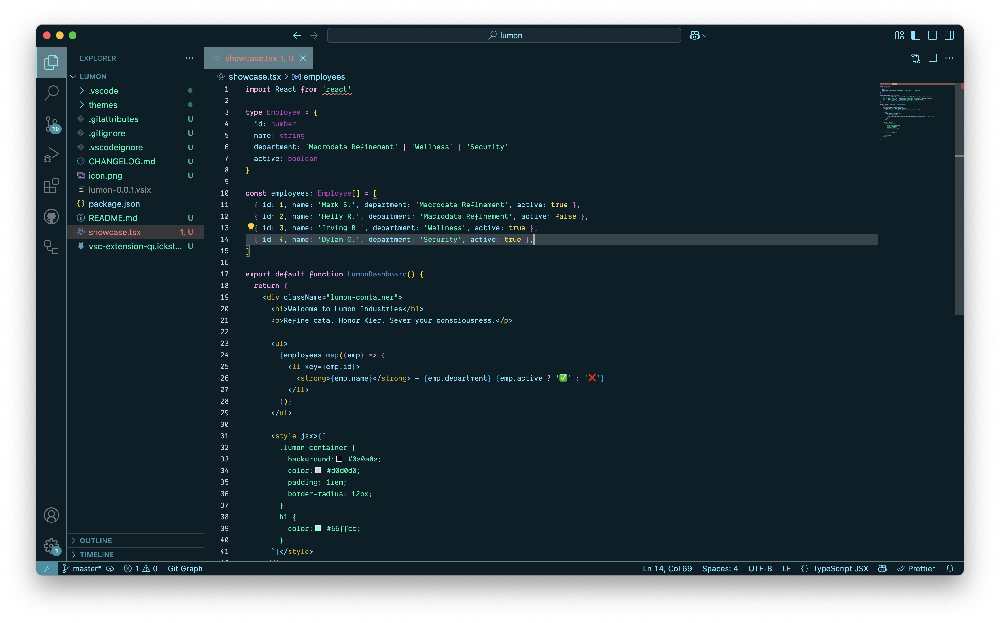

# Lumon

> A minimal, sleek, and unnervingly calm VSCode theme inspired by the world of **Severance**. For when you want your code to feel like it's being written under fluorescent lights deep in the belly of Lumon Industries.

---

## 🎨 Features

- Carefully balanced colors for maximum clarity and minimal eye strain
- Dark mode only – just like your Lumon cubicle
- Optimized for TypeScript, JavaScript, HTML, CSS, JSON, Markdown, and more
- Cursor and VSCode compatible ✅
- Subtle syntax colors, stark contrasts — Lumon-approved

---

## 🧪 Installation

### VS Code

1. Press `Ctrl+P` or `Cmd+P` to open the Quick Open dialog
2. Run: `ext install cluzier.lumon`
3. Choose **"Lumon"** from the Color Theme list

Or search for **Lumon** in the Extensions view.

### Cursor (AI Editor)

1. Press `Cmd+Shift+P` → "Preferences: Color Theme"
2. Click **"Install Additional Color Themes"**
3. Search for **Lumon**
4. Apply and get focused 🧠

---

## 🖼️ Screenshot

> Terminal green meets sterile cubicle gray.

---

## 📦 Contributing

Pull requests are welcome! If you have tweaks to the theme or want to adapt it to other languages/frameworks, feel free to contribute.

---

## 🧠 Severed You, Meet Developer You

This theme is a vibe — designed to disappear into the background and let you enter flow state.

---

## 📫 Stay in Touch

For suggestions, reach out on GitHub or submit an issue.

---

> “The work is mysterious and important.”  
> – Mark S.

